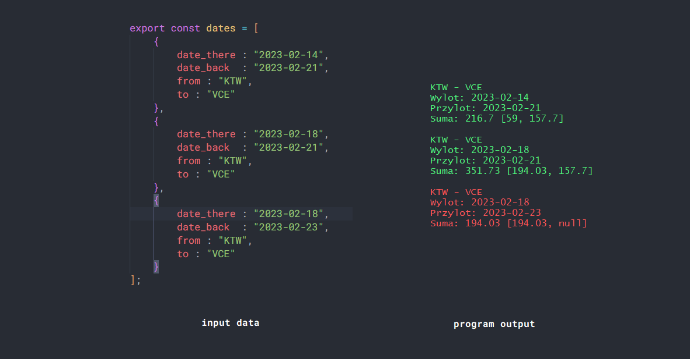

## How to use
### 1. Installation
```bash
git clone https://github.com/sebastian-sobik/Ryanair-Flights.git
npm install
```
### 2. Inserting your flight data
Add your flight representing javascript object to array in **flights-data.js**.
Structure of flight object: 
```bash
 {
            date_there : "YYYY-MM-DD",
            date_back  : "YYYY-MM-DD",
            from : "IATA-Airport-Code",
            to : "IATA-Airport-Code"
 }
```
**IATA-Airport-Code** can be found here: [a link](https://www.iata.org/en/publications/directories/code-search/#:~:text=Search%20Location%20Codes-,Search,-SEARCH%20NOW) 

### 3. Running app options
#### Standard way: 
```bash
node app.js 
```
#### Flags 
```bash
--invalid			// shows full info about invalid flights
--url			      // shows url where you can buy listed flight
--object			// shows object with flight info and prices
```
#### Using flags example
```bash 
node app.js --url --invalid // shows urls and invalid flights
```
